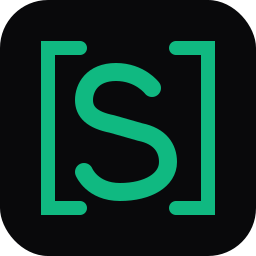
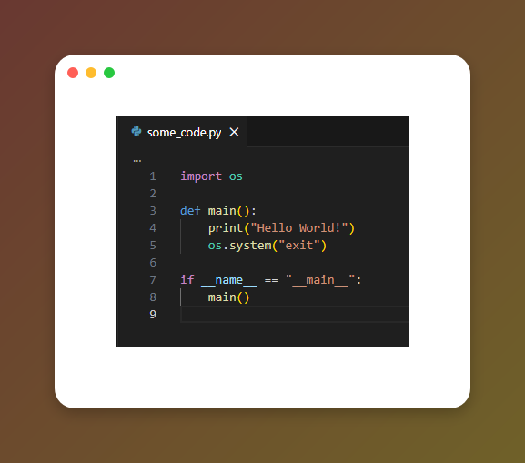
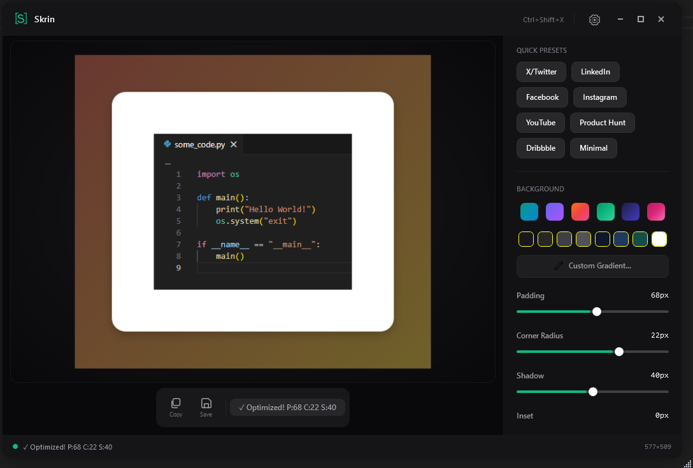
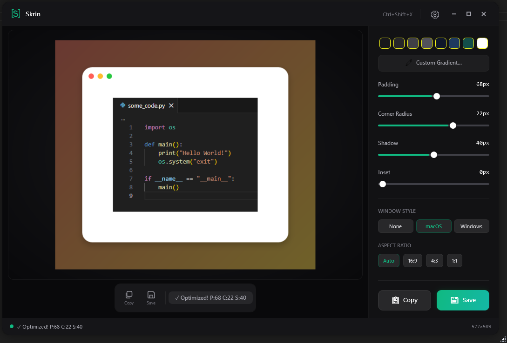

  

<h1 align="center">Skrin</h1>

  <strong>Screenshot beautifier for Windows 10 & 11</strong> 
  Transform plain screenshots into stunning visuals with gradient backgrounds, shadows, and social media presets.

  <a href="https://skrin.app">Website</a> ·
  <a href="https://skrin.app/faq/">FAQ</a> ·
  <a href="https://skrin.app/#waitlist">Join Waitlist</a>
  <a href="https://www.producthunt.com/products/skrin">ProductHunt</a>

  
  
  
  

---

  

## The problem

macOS has [CleanShot X](https://cleanshot.com/) and [Xnapper](https://xnapper.com/) for making screenshots look professional. Windows has nothing. You either paste raw captures into tweets and docs, or spend 5 minutes in Figma manually adding backgrounds and shadows every single time.

## The solution

Press `Ctrl+Shift+X` from any app. Select a region or window. Skrin automatically wraps your screenshot in a styled gradient background with optimal padding, rounded corners, and shadows. Copy to clipboard or save. Under 3 seconds.

  

## Features

**Capture**
- Region capture with pixel-perfect 10x magnifier, pixel grid, and coordinate display
- Window capture via PrintWindow API — clean isolation without OS shadows
- Paste from clipboard (`Ctrl+V`) or drag-and-drop image files

**Style**
- 6 gradient presets + 8 solid colors + full custom gradient editor (Linear, Radial, Conic)
- Smart Auto-Balance — AI analyzes image size, edge colors, luminance, and variance to auto-apply optimal styling
- Smart Background — detects dominant accent color and generates a matching gradient
- Padding (0–128px), corner radius (0–32px), shadow (0–80px), inset border (0–24px)
- Window chrome decoration: macOS traffic lights or Windows title bar

**Export**
- 15+ social media presets with exact dimensions (Twitter/X, LinkedIn, Instagram, YouTube, Pinterest, Discord, Product Hunt, Dribbble)
- Custom aspect ratios: Auto, 1:1, 4:3, 3:2, 16:9, 16:10, 21:9
- Export as PNG, JPEG, WebP, or GIF
- One-click copy to clipboard (`Ctrl+C`)

**Zero friction**
- Global hotkey `Ctrl+Shift+X` from any application
- System tray — runs in background, always accessible
- Single self-contained EXE — no .NET runtime, no installer, no account, no internet required

  

## Keyboard shortcuts

| Shortcut | Action |
|---|---|
| `Ctrl+Shift+X` | Global capture (works from any app) |
| `Space` | Toggle region / window capture |
| `Ctrl+C` | Copy styled image to clipboard |
| `Ctrl+S` | Save to file |
| `Ctrl+V` | Paste image from clipboard |
| `Ctrl+Z` / `Ctrl+Y` | Undo / Redo |
| `Esc` | Cancel capture |
| `Enter` | Confirm window capture |

## How it compares

| Feature | Skrin | Snipping Tool | ShareX | CleanShot X | Xnapper |
|---|---|---|---|---|---|
| Platform | **Windows** | Windows | Windows | macOS only | macOS only |
| Gradient backgrounds | ✅ Custom editor | ❌ | ❌ | ✅ Custom backgrounds | ✅ Presets only |
| Custom gradient editor | ✅ Linear/Radial/Conic | ❌ | ❌ | ~ Basic | ❌ |
| Smart Auto-Balance (AI) | ✅ | ❌ | ❌ | ❌ | ✅ Smart balance |
| Social media presets | ✅ 15+ platforms | ❌ | ❌ | ~ Some | ✅ Platform ratios |
| Padding / shadow / corners | ✅ Full controls | ❌ | ❌ | ✅ | ✅ |
| Window chrome | ✅ macOS + Windows | ❌ | ❌ | ✅ macOS only | ❌ |
| Pixel-perfect magnifier | ✅ 10x + grid | ❌ | ~ Basic | ❌ | ❌ |
| Annotation tools | ❌ | ✅ Basic | ✅ Extensive | ✅ 50+ tools | ✅ Basic |
| Screen recording | ❌ | ✅ Basic (Win 11) | ✅ Video + GIF | ✅ Video + GIF | ❌ |
| Scrolling capture | ❌ | ❌ | ✅ | ✅ | ❌ |
| OCR | ❌ | ❌ | ✅ | ✅ | ✅ |
| Auto-redact sensitive info | ❌ | ❌ | ❌ | ❌ | ✅ |
| Cloud sharing | ❌ | ❌ | ✅ 80+ destinations | ✅ CleanShot Cloud | ❌ |
| Export formats | PNG, JPEG, WebP, GIF | PNG, JPEG | Many | Many | PNG, JPEG |
| Price | **$23 lifetime** | Free | Free (open source) | $29 + $19/yr updates | $29.99 + $18/yr renewal |

Detailed comparisons: [vs CleanShot X](https://skrin.app/compare/cleanshot-x-alternative/) · [vs Xnapper](https://skrin.app/compare/xnapper-alternative/) · [vs ShareX](https://skrin.app/compare/sharex-alternative/) · [vs Snipping Tool](https://skrin.app/compare/snipping-tool-alternative/)

## Pricing

- **$10** — Early Bird lifetime license (first 100 waitlist signups)
- **$23** — Standard lifetime license

One-time payment. No subscriptions. All future updates included.

## Built with

- **C# / WPF** — .NET 8, native Windows performance
- **SkiaSharp** — GPU-accelerated 2D rendering
- **CommunityToolkit.Mvvm** — MVVM architecture
- **Win32 P/Invoke** — GDI+ screen capture, PrintWindow API, DWM Extended Frame Bounds

## Status

Skrin is in closed beta. Launching late 2026.

**[→ Join the waitlist](https://skrin.app/#waitlist)**

## Links

- Website: [skrin.app](https://skrin.app)
- FAQ: [skrin.app/faq](https://skrin.app/faq/)
- Contact: support@skrin.app
